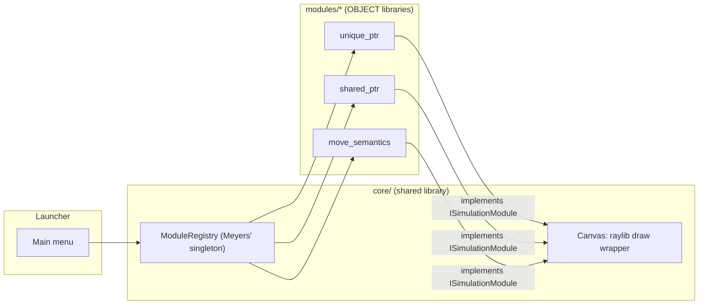
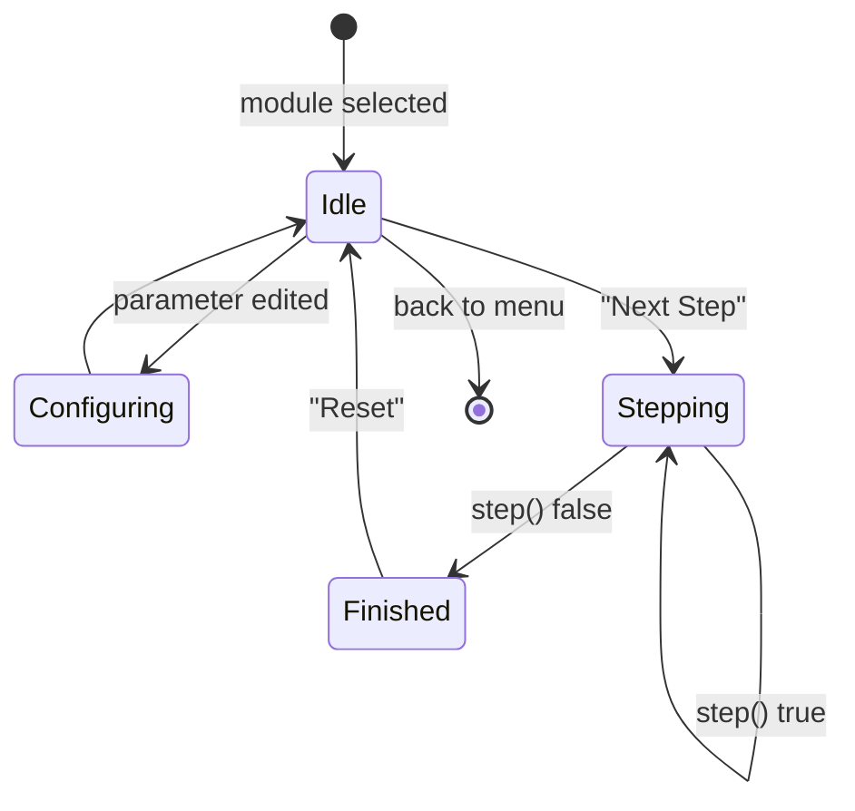

# Architecture

## Component overview

## Module lifecycle

v1 launcher UI collapses Idle/Configuring/Finished into one screen (parameters stay editable at any time); see `CLAUDE.md` → "Known simplifications".

## Why OBJECT libraries, not STATIC

Each module is a CMake `OBJECT` library. A module registers itself with `ModuleRegistry` via a namespace-scope global whose constructor runs at static-initialization time — nothing else in the program calls into that translation unit. If the module were a `STATIC` library, a linker is free to drop that `.o` from the final binary because no symbol in it is referenced (a well-known footgun with self-registration patterns and static archives). `OBJECT` libraries don't have this problem: `target_link_libraries` on an `OBJECT` library always pulls in every object file.

## Why the registry is a Meyers' singleton

Self-registering modules only work safely if the registry they register into is guaranteed to exist before any registrar's constructor runs — and the order in which different translation units' global constructors run is unspecified in C++. A function-local `static` inside `ModuleRegistry::instance()` sidesteps the ordering problem entirely: whichever registrar runs first *is* the call that constructs the registry, no matter which module that is.

## Why no live compilation

Editable code would need an in-process compiler and sandboxing; this repo optimizes for "understand what's already there" over "experiment freely." Parameters (starting values) are editable; the code snippet shown alongside them is fixed per module.

## Elenen alternatifler (see spec for full detail)

- Per-module separate executables — rejected: duplicates window/input boilerplate per module, breaks in-app navigation.
- Runtime plugin/dynamic library modules — rejected: cross-platform dynamic loading + ABI stability unneeded at this scale.
- Global (non-lazy) static self-registration — rejected: static-initialization-order fiasco risk.
