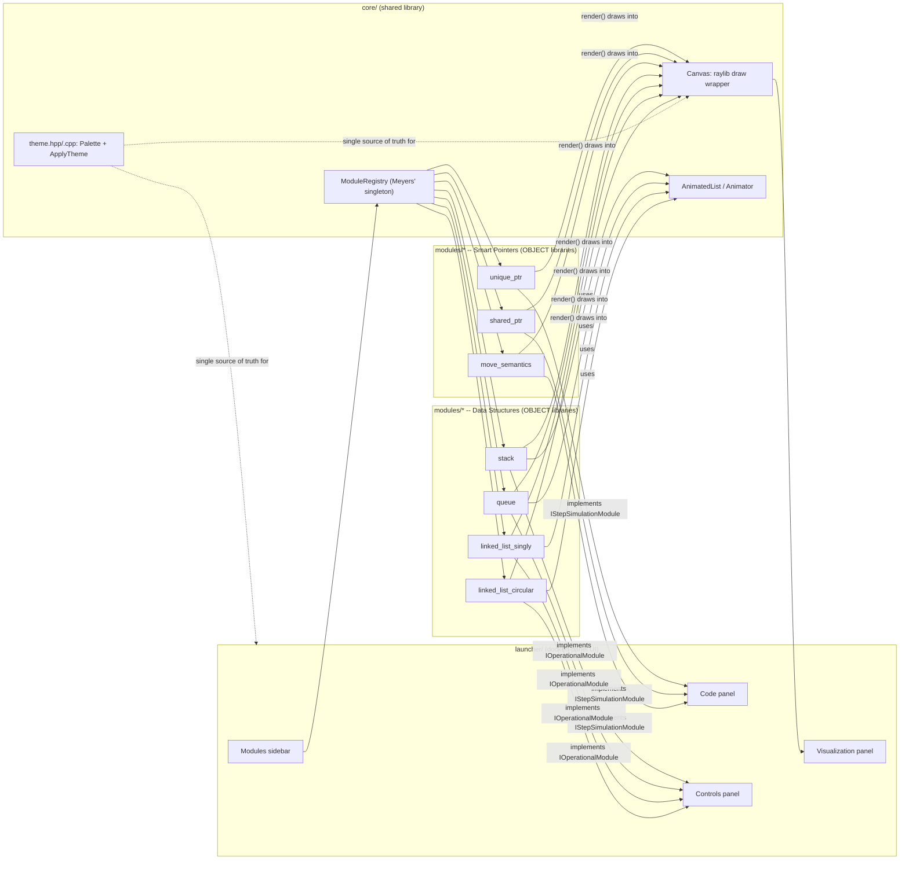

# Architecture

## Component overview

## The two module kinds

`ISimulationModule` (`core/include/underhood/simulation_module.hpp`) is the
common base every module implements: `name()`, `codeSnippet()`, `render()`,
and `kind()`. `kind()` tells the launcher which of two derived interfaces to
cast to and which panel set to draw -- a module never implements both.

- **`IStepSimulationModule`** -- a single fixed, pre-scripted scenario the
  viewer steps through one line at a time via `step()`, with editable
  starting `parameters()` and a `currentHighlightedLine()` the Code panel
  highlights. Pattern: `unique_ptr`, `shared_ptr`, `move_semantics` (category
  "Smart Pointers"). `codeSnippet()` returns the fixed snippet shown
  alongside the visualization; only parameter *values* are editable, there's
  no live compilation.
- **`IOperationalModule`** -- an open-ended structure the viewer drives with
  Push/Pop-style buttons (`operations()`, `canPerform()`,
  `performOperation()`) and a value input, with no fixed code snippet
  (`codeSnippet()` returns `""` -- the Code panel shows a placeholder
  instead). Keeps an append-only `history()` log the Controls panel shows
  reversed (newest first), advances its own insert/remove animations every
  frame via `update(float deltaTime)`, and resets instantly via `clear()`.
  Pattern: `stack`, `queue`, `linked_list_singly`, `linked_list_circular`
  (category "Data Structures").

## Shared animation infrastructure

`IOperationalModule` implementations don't roll their own animation
bookkeeping. Two small core types handle it:

- **`Animator`** (`core/include/underhood/animation.hpp`) -- a 0.30s
  ease-out progress tracker. `start()` begins it, `update(deltaTime)`
  advances it, `progress()` returns 0..1 (eased), `isAnimating()` reports
  whether it's still running. Owns no rendering state itself; a module's
  `render()` reads `progress()` each frame to interpolate a box's slide
  offset or fade.
- **`AnimatedList<T>`** (`core/include/underhood/animated_list.hpp`) -- a
  generic ordered collection pairing each entry with its own `Animator`.
  `insertAt(index, value)` starts that entry's insert animation.
  `removeAt(index)` moves the removed entry into a single `removingEntry()`
  slot (instead of deleting it immediately) and restarts its `Animator`, so
  `render()` can still draw it mid-animation; because that shares the same
  `Animator` as a fresh insert, a module's `render()` must invert
  `progress()` (`1.0f - entry.insertAnim.progress()`) when drawing the
  removing entry specifically, so the departing box animates OUT (starts
  "arrived", fades/slides toward "departed") rather than replaying an insert
  on top of whatever now occupies its old slot. `stack`'s `render()` sidesteps
  this by drawing the removing entry one slot above the current top instead,
  where it can never overlap a live box either way.

Each of the 4 Data Structures modules also shares one **`OperationHistory`**
(`core/include/underhood/operation_history.hpp`) for its `history()` log --
an append-only, capped-at-10-entries log (oldest drops first) instead of each
module reimplementing the same cap logic.

## Theme: single source of truth

`underhood::Palette`/`GetPalette`/`ApplyTheme`
(`core/include/underhood/theme.hpp`, `core/src/theme.cpp`) are the one place
color values are defined -- a dark and a light `Palette`, each specifying
chrome colors (background/surface/border/text) and the three semantic
`Canvas` accent colors (`accentEmpty`/`accentOwned`/`accentJustChanged`).
`ApplyTheme(dark)` pushes a palette into ImGui's `ImGuiStyle::Colors`;
`Canvas::setDarkTheme(dark)` (`core/include/underhood/canvas.hpp`) points
`Canvas`'s raylib-drawn boxes at the same palette. Both read from the same
`GetPalette()` call, so the ImGui chrome and the raylib-drawn simulation
boxes can never drift into two different "dark themes" by accident. Any UI
code that needs a semantic color (e.g. the launcher's Code panel
highlighting the "just changed" line) reads it from the active `Palette`
rather than hardcoding a literal, for the same reason.

## Launcher layout

The launcher (`launcher/main.cpp`) is a single docked-panel layout, not a
menu screen the user navigates into and out of. `ImGui::DockBuilder*` builds
a fixed layout once per run (`io.IniFilename` is null, so there's no stale
`imgui.ini` to fight): a persistent left **Modules** sidebar lists every
registered module grouped by category (visualgo.net/dsa-visualizer-style
nav), with **Code**, **Controls**, and **Visualization** panels docked to
the right. Selecting a module in the sidebar swaps which module is active in
place -- there is no "back to menu" state, and re-clicking the
already-active module is a no-op rather than rebuilding it (which would
silently discard any state the viewer built up, e.g. a stack they pushed
values onto). The active module renders into a `RenderTexture2D` sized to
match the Visualization panel's content region exactly, letterboxed into a
fixed logical coordinate space so modules never need to know the window's
real pixel size.

## Why OBJECT libraries, not STATIC

Each module is a CMake `OBJECT` library. A module registers itself with
`ModuleRegistry` via a namespace-scope global whose constructor runs at
static-initialization time -- nothing else in the program calls into that
translation unit. If the module were a `STATIC` library, a linker is free to
drop that `.o` from the final binary because no symbol in it is referenced
(a well-known footgun with self-registration patterns and static archives).
`OBJECT` libraries don't have this problem: `target_link_libraries` on an
`OBJECT` library always pulls in every object file. Each module is also
gated behind its own `BUILD_MODULE_<NAME>` CMake option
(`modules/CMakeLists.txt`), so a broken module fails CI in isolation and can
be disabled without blocking the others.

## Why the registry is a Meyers' singleton

Self-registering modules only work safely if the registry they register into
is guaranteed to exist before any registrar's constructor runs -- and the
order in which different translation units' global constructors run is
unspecified in C++. A function-local `static` inside
`ModuleRegistry::instance()` (`core/include/underhood/module_registry.hpp`)
sidesteps the ordering problem entirely: whichever registrar runs first *is*
the call that constructs the registry, no matter which module that is.
`registerModule(name, factory, category)` also records the category used to
group the launcher sidebar (`categories()` returns categories in
first-registered order, each with its module names alphabetically sorted).

## Why no live compilation

Editable code would need an in-process compiler and sandboxing; this repo
optimizes for "understand what's already there" over "experiment freely."
For `IStepSimulationModule`s, parameters (starting values) are editable; the
code snippet shown alongside them is fixed per module. `IOperationalModule`s
have no code snippet at all -- their state speaks for itself through the
visualization.

## Elenen alternatifler (see spec for full detail)

- Per-module separate executables -- rejected: duplicates window/input
  boilerplate per module, breaks in-app navigation.
- Runtime plugin/dynamic library modules -- rejected: cross-platform dynamic
  loading + ABI stability unneeded at this scale.
- Global (non-lazy) static self-registration -- rejected:
  static-initialization-order fiasco risk.
- A single `ISimulationModule` for both scripted and open-ended modules --
  rejected once the Data Structures modules were added: forcing "no fixed
  code snippet, open-ended operations, per-frame animation" through the same
  interface as "fixed scenario, step() advances a state machine" would have
  meant lots of unused/nullable methods on both sides. Splitting into
  `IStepSimulationModule`/`IOperationalModule` under a common
  `ISimulationModule` base keeps each interface's methods meaningful for
  every implementer.
