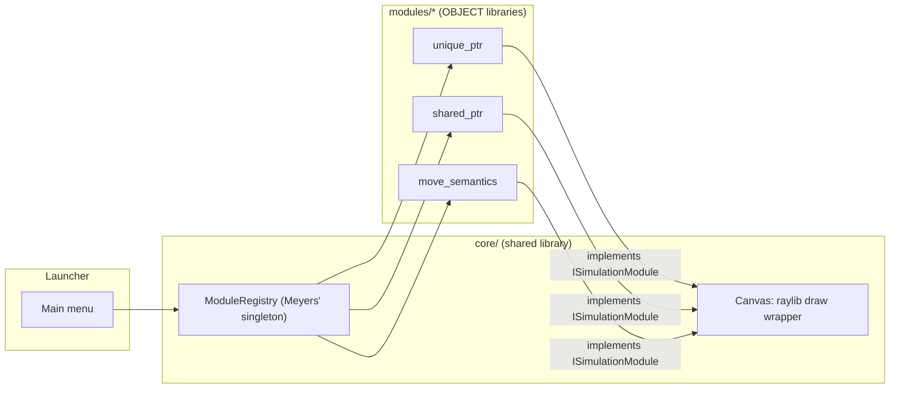
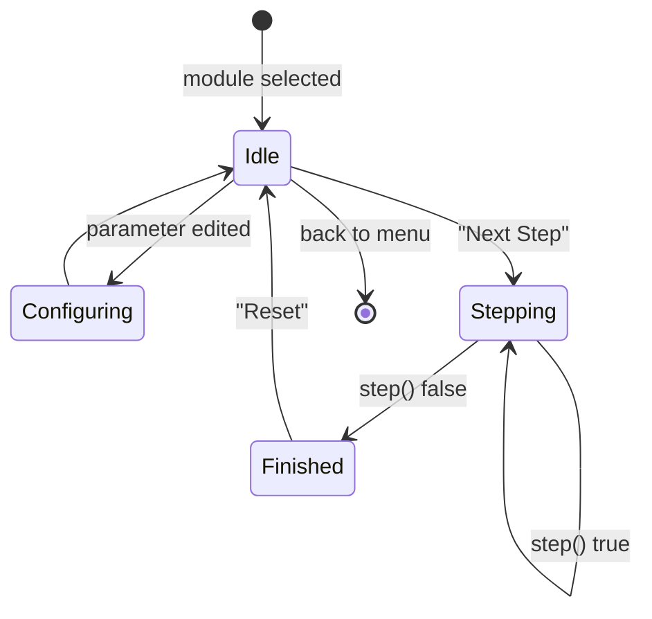

# underhood — Core Framework + First 3 Modules Implementation Plan

> **For agentic workers:** REQUIRED SUB-SKILL: Use superpowers:subagent-driven-development (recommended) or superpowers:executing-plans to implement this plan task-by-task. Steps use checkbox (`- [ ]`) syntax for tracking.

**Goal:** Build the underhood launcher framework (module interface, registry, raylib+Dear ImGui shell) and ship it working end-to-end with three real simulation modules (`unique_ptr`, `shared_ptr`, `move_semantics`).

**Architecture:** A single launcher executable links against a shared `underhood_core` library (module interface + Meyers'-singleton registry + a thin raylib drawing wrapper) and against one `OBJECT` library per topic under `modules/<name>/`. Each module self-registers with the registry via a namespace-scope global whose constructor calls `ModuleRegistry::instance()` — safe regardless of static-initialization order because the registry itself is lazily constructed on first use. The launcher shows a menu of registered modules; picking one shows a fixed code snippet, an editable-parameter panel (Dear ImGui), and a `render()`-driven view of the module's current state, advanced one `step()` at a time.

**Tech Stack:** C++17, CMake (FetchContent), raylib, Dear ImGui, rlImGui, Catch2.

**Spec:** `docs/superpowers/specs/2026-08-24-underhood-core-design.md`

## Global Constraints

- C++ standard: C++17, enforced via `CMAKE_CXX_STANDARD 17` / `CMAKE_CXX_STANDARD_REQUIRED ON`.
- CMake minimum version: 3.20.
- Modules are `add_library(... OBJECT ...)`, never `STATIC` — a `STATIC` archive lets linkers silently drop an unreferenced `.o`, which would drop a module's self-registration global along with it.
- Each module is gated by its own `BUILD_MODULE_<NAME>` CMake option (default `ON`) so a broken module can be disabled without touching the others.
- Registry is a Meyers' singleton (function-local `static` inside `ModuleRegistry::instance()`) — never a namespace-scope global registry object.
- Displayed code is always fixed; only starting parameter *values* are editable from the UI. No live compilation, no code editor.
- License: MIT. Docs language: English (README, CLAUDE.md — portfolio/dev audience per project standards §7). Vault-facing notes stay Turkish, not part of this repo.
- CI matrix: `ubuntu-latest`, `windows-latest`, `macos-latest`, `build + test` only (no separate sanitizer job for v1 — out of scope, not requested by spec).
- Commit messages: Conventional Commits, English, imperative mood, no AI co-author trailer (project standard, non-negotiable).

---

### Task 1: Repo scaffolding & docs

**Files:**
- Create: `README.md`
- Create: `CLAUDE.md`
- Create: `LICENSE`
- Create: `.gitignore`
- Create: `.clang-format`
- Create: `HANDOFF.md`
- Create: `docs/architecture.md`

**Interfaces:** None — this task produces no code, only project documentation later tasks will link to.

- [ ] **Step 1: Write `README.md`**

```md
# underhood

Interactive C++ simulations that make niche language behavior (smart pointer ownership, move semantics, and more) visible instead of abstract.

## Why
Reasoning about ownership transfer, reference counting, or move semantics from text alone is hard to retain. underhood renders a fixed code snippet next to an animated view of memory/ownership state, stepped one line at a time, with editable starting parameters — so the mental model has something to point at.

## Stack
C++17 · CMake · raylib · Dear ImGui (via rlImGui) · Catch2

## Quick start
```bash
git clone <repo-url>
cd underhood
cmake -S . -B build
cmake --build build --parallel
./build/launcher/underhood
```

## Documentation
- [Architecture](docs/architecture.md)
- [Contributing a new module](CONTRIBUTING.md)

## License
MIT — see [LICENSE](LICENSE)
```

- [ ] **Step 2: Write `CLAUDE.md`**

```md
# underhood — CLAUDE.md

Interactive C++ simulations for niche language behavior (smart pointers, move semantics, more later). See [README.md](README.md) for the pitch and [docs/architecture.md](docs/architecture.md) for the full design rationale. Handoff state: [HANDOFF.md](HANDOFF.md).

## Running

```bash
cmake -S . -B build
cmake --build build --parallel
ctest --test-dir build --output-on-failure
./build/launcher/underhood
```

## Architecture (why, not what — see docs/architecture.md for detail)

- Single launcher binary. Each topic is an independent CMake `OBJECT` library under `modules/<name>/` implementing `ISimulationModule` (`core/include/underhood/simulation_module.hpp`). `OBJECT` (not `STATIC`) is deliberate: a module's self-registration global only runs if its object file is actually linked in, and linkers can silently drop unreferenced members of a `STATIC` archive.
- `ModuleRegistry` (`core/include/underhood/module_registry.hpp`) is a Meyers' singleton (function-local `static`) specifically to avoid static-initialization-order-fiasco: each module's self-registering global calls `ModuleRegistry::instance()`, which is safe to call in any order because the singleton constructs itself lazily on first use.
- Code shown in a module is always fixed; only starting parameter *values* are editable from the UI. No live compilation.
- Each module is toggled by its own `BUILD_MODULE_<NAME>` CMake option, so a broken module fails CI in isolation and can be disabled without blocking the others.

## Adding a module

See [CONTRIBUTING.md](CONTRIBUTING.md).

## Known simplifications (v1)

- The full Idle/Configuring/Stepping/Finished state diagram in the design spec is collapsed in the launcher UI: parameters are editable at any time, and there's no distinct visual "Finished" state beyond `step()` returning `false`. Revisit if this causes confusion in practice.
- The spec calls for "animated" state updates; v1 renders each `step()` result as an instant snap (no interpolation/tweening between states). The state itself still changes per step and is visually clear, but there's no motion. If step-to-step snapping turns out to hurt retention, add tweening (e.g. lerp box positions/opacity over a few frames) inside `Canvas`/`render()` without touching the `ISimulationModule` interface.
```

- [ ] **Step 3: Write `LICENSE`** (MIT, copyright Efecan Cengiz, 2026)

```
MIT License

Copyright (c) 2026 Efecan Cengiz

Permission is hereby granted, free of charge, to any person obtaining a copy
of this software and associated documentation files (the "Software"), to deal
in the Software without restriction, including without limitation the rights
to use, copy, modify, merge, publish, distribute, sublicense, and/or sell
copies of the Software, and to permit persons to whom the Software is
furnished to do so, subject to the following conditions:

The above copyright notice and this permission notice shall be included in all
copies or substantial portions of the Software.

THE SOFTWARE IS PROVIDED "AS IS", WITHOUT WARRANTY OF ANY KIND, EXPRESS OR
IMPLIED, INCLUDING BUT NOT LIMITED TO THE WARRANTIES OF MERCHANTABILITY,
FITNESS FOR A PARTICULAR PURPOSE AND NONINFRINGEMENT. IN NO EVENT SHALL THE
AUTHORS OR COPYRIGHT HOLDERS BE LIABLE FOR ANY CLAIM, DAMAGES OR OTHER
LIABILITY, WHETHER IN AN ACTION OF CONTRACT, TORT OR OTHERWISE, ARISING FROM,
OUT OF OR IN CONNECTION WITH THE SOFTWARE OR THE USE OR OTHER DEALINGS IN THE
SOFTWARE.
```

- [ ] **Step 4: Write `.gitignore`**

```
build/
build-*/
CMakeCache.txt
CMakeFiles/
*.obj
*.o
.vs/
.vscode/
*.user
```

- [ ] **Step 5: Write `.clang-format`** (matches the user's other C++ project, `gradus`)

```yaml
BasedOnStyle: Google
ColumnLimit: 100
IndentWidth: 4
AccessModifierOffset: -2
```

- [ ] **Step 6: Write `docs/architecture.md`**

```md
# Architecture

## Component overview



## Module lifecycle



v1 launcher UI collapses Idle/Configuring/Finished into one screen (parameters stay editable at any time); see `CLAUDE.md` → "Known simplifications".

## Why OBJECT libraries, not STATIC

Each module is a CMake `OBJECT` library. A module registers itself with `ModuleRegistry` via a namespace-scope global whose constructor runs at static-initialization time — nothing else in the program calls into that translation unit. If the module were a `STATIC` library, a linker is free to drop that `.o` from the final binary because no symbol in it is referenced (a well-known footgun with self-registration patterns and static archives). `OBJECT` libraries don't have this problem: `target_link_libraries` on an `OBJECT` library always pulls in every object file.

## Why the registry is a Meyers' singleton

Self-registering modules only work safely if the registry they register into is guaranteed to exist before any registrar's constructor runs — and the order in which different translation units' global constructors run is unspecified in C++. A function-local `static` inside `ModuleRegistry::instance()` sidesteps the ordering problem entirely: whichever registrar runs first *is* the call that constructs the registry, no matter which module that is.

## Why no live compilation

Editable code would need an in-process compiler and sandboxing; this repo optimizes for "understand what's already there" over "experiment freely." Parameters (starting values) are editable; the code snippet shown alongside them is fixed per module.

## Elenen alternatifler (see spec for full detail)

- Per-module separate executables — rejected: duplicates window/input boilerplate per module, breaks in-app navigation.
- Runtime plugin/dynamic library modules — rejected: cross-platform dynamic loading + ABI stability unneeded at this scale.
- Global (non-lazy) static self-registration — rejected: static-initialization-order fiasco risk.
```

- [ ] **Step 7: Write `HANDOFF.md`**

```md
# Handoff — underhood
Son güncelleme: 2026-08-24, güncelleyen: Claude Sonnet 5

## Şu an ne yapılıyor
İlk implementasyon planı yazıldı (docs/superpowers/plans/2026-08-24-underhood-core-and-first-modules.md), Task 1 (repo scaffolding) uygulanıyor.

## Sıradaki somut adım
Plan dosyasındaki Task 2'den (CMake root + Catch2 smoke test) devam et.

## Bilinmesi gerekenler
- Henüz denenip başarısız olmuş bir yaklaşım yok.
- OBJECT library kararı bilinçli: STATIC library kullanılırsa self-registration global'leri linker tarafından silinebilir.

## İlgili dosyalar
- docs/superpowers/specs/2026-08-24-underhood-core-design.md — tam tasarım kararları
- docs/superpowers/plans/2026-08-24-underhood-core-and-first-modules.md — implementasyon planı

## Son 3 commit
- (henüz commit yok)
```

- [ ] **Step 8: Commit**

```bash
git add README.md CLAUDE.md LICENSE .gitignore .clang-format HANDOFF.md docs/architecture.md
git commit -m "docs: add project scaffolding and architecture overview"
```

---

### Task 2: CMake root skeleton + Catch2 smoke test

**Files:**
- Create: `CMakeLists.txt`
- Create: `tests/CMakeLists.txt`
- Create: `tests/test_smoke.cpp`

**Interfaces:** None yet — proves the CMake + Catch2 toolchain works before any real code exists.

- [ ] **Step 1: Write root `CMakeLists.txt`**

```cmake
cmake_minimum_required(VERSION 3.20)
project(underhood CXX)

set(CMAKE_CXX_STANDARD 17)
set(CMAKE_CXX_STANDARD_REQUIRED ON)

include(FetchContent)

FetchContent_Declare(
  catch2
  GIT_REPOSITORY https://github.com/catchorg/Catch2.git
  GIT_TAG v3.6.0
)
FetchContent_MakeAvailable(catch2)

enable_testing()
add_subdirectory(tests)
```

- [ ] **Step 2: Write `tests/CMakeLists.txt`**

```cmake
add_executable(underhood_tests
  test_smoke.cpp
)
target_link_libraries(underhood_tests PRIVATE Catch2::Catch2WithMain)

list(APPEND CMAKE_MODULE_PATH ${catch2_SOURCE_DIR}/extras)
include(Catch)
catch_discover_tests(underhood_tests)
```

- [ ] **Step 3: Write `tests/test_smoke.cpp`**

```cpp
#include <catch2/catch_test_macros.hpp>

TEST_CASE("toolchain smoke test") {
    REQUIRE(1 + 1 == 2);
}
```

- [ ] **Step 4: Configure, build, and run the smoke test**

Run:
```bash
cmake -S . -B build
cmake --build build --parallel
ctest --test-dir build --output-on-failure
```
Expected: configure succeeds, build succeeds, `ctest` reports 1 test passed ("toolchain smoke test"). This step will take a few minutes the first time (Catch2 is fetched and built from source).

- [ ] **Step 5: Commit**

```bash
git add CMakeLists.txt tests/CMakeLists.txt tests/test_smoke.cpp
git commit -m "chore: set up CMake + Catch2 toolchain with a smoke test"
```

---

### Task 3: Core interface — `Parameter` + `ISimulationModule`

**Files:**
- Create: `core/include/underhood/parameter.hpp`
- Create: `core/include/underhood/simulation_module.hpp`

**Interfaces:**
- Produces: `underhood::Parameter{name: std::string, value: int, minValue: int, maxValue: int}`
- Produces: `underhood::ISimulationModule` — pure virtual base every module implements: `name()`, `codeSnippet()`, `parameters()`, `reset(const std::vector<Parameter>&)`, `step() -> bool`, `currentHighlightedLine() -> int`, `render(Canvas&) const` (forward-declared `Canvas`, defined in Task 6).

No build wiring yet — these are header-only files with no CMake target; Task 4 creates the `underhood_core` library that exposes this include directory.

- [ ] **Step 1: Write `core/include/underhood/parameter.hpp`**

```cpp
#pragma once

#include <string>

namespace underhood {

struct Parameter {
    std::string name;
    int value;
    int minValue;
    int maxValue;
};

}  // namespace underhood
```

- [ ] **Step 2: Write `core/include/underhood/simulation_module.hpp`**

```cpp
#pragma once

#include <string>
#include <vector>

#include "underhood/parameter.hpp"

namespace underhood {

class Canvas;  // defined in core/include/underhood/canvas.hpp (Task 6)

class ISimulationModule {
public:
    virtual ~ISimulationModule() = default;

    virtual std::string name() const = 0;
    virtual std::string codeSnippet() const = 0;
    virtual std::vector<Parameter> parameters() const = 0;
    virtual void reset(const std::vector<Parameter>& params) = 0;
    virtual bool step() = 0;
    virtual int currentHighlightedLine() const = 0;
    virtual void render(Canvas& canvas) const = 0;
};

}  // namespace underhood
```

- [ ] **Step 3: Commit**

```bash
git add core/include/underhood/parameter.hpp core/include/underhood/simulation_module.hpp
git commit -m "feat: add Parameter struct and ISimulationModule interface"
```

---

### Task 4: `ModuleRegistry` (Meyers' singleton) + unit tests

**Files:**
- Create: `core/include/underhood/module_registry.hpp`
- Create: `core/src/module_registry.cpp`
- Create: `core/CMakeLists.txt`
- Create: `tests/test_module_registry.cpp`
- Modify: `CMakeLists.txt` (add `add_subdirectory(core)` before `add_subdirectory(tests)`)
- Modify: `tests/CMakeLists.txt` (add the new test file + link `underhood_core`)

**Interfaces:**
- Consumes: `underhood::ISimulationModule` (Task 3)
- Produces: `underhood::ModuleRegistry` with `static ModuleRegistry& instance()`, `void registerModule(const std::string& name, Factory factory)`, `std::vector<std::string> moduleNames() const`, `std::unique_ptr<ISimulationModule> create(const std::string& name) const`, where `Factory = std::function<std::unique_ptr<ISimulationModule>()>`.
- Produces: CMake target `underhood_core` (`STATIC` library, `PUBLIC` include dir `core/include`) — later tasks link against this.

- [ ] **Step 1: Write the failing test — `tests/test_module_registry.cpp`**

```cpp
#include <algorithm>
#include <catch2/catch_test_macros.hpp>
#include <memory>

#include "underhood/module_registry.hpp"

namespace {

class FakeModule : public underhood::ISimulationModule {
public:
    std::string name() const override { return "fake"; }
    std::string codeSnippet() const override { return "// fake"; }
    std::vector<underhood::Parameter> parameters() const override { return {}; }
    void reset(const std::vector<underhood::Parameter>&) override {}
    bool step() override { return false; }
    int currentHighlightedLine() const override { return 1; }
    void render(underhood::Canvas&) const override {}
};

}  // namespace

TEST_CASE("ModuleRegistry registers and creates modules by name") {
    auto& registry = underhood::ModuleRegistry::instance();
    registry.registerModule("fake_registry_test", []() {
        return std::make_unique<FakeModule>();
    });

    auto names = registry.moduleNames();
    REQUIRE(std::find(names.begin(), names.end(), "fake_registry_test") != names.end());

    auto instance = registry.create("fake_registry_test");
    REQUIRE(instance != nullptr);
    REQUIRE(instance->name() == "fake");
}

TEST_CASE("ModuleRegistry returns nullptr for an unknown module name") {
    auto& registry = underhood::ModuleRegistry::instance();
    REQUIRE(registry.create("does_not_exist_at_all") == nullptr);
}
```

- [ ] **Step 2: Write `core/include/underhood/module_registry.hpp`**

```cpp
#pragma once

#include <functional>
#include <map>
#include <memory>
#include <string>
#include <vector>

#include "underhood/simulation_module.hpp"

namespace underhood {

class ModuleRegistry {
public:
    using Factory = std::function<std::unique_ptr<ISimulationModule>()>;

    static ModuleRegistry& instance();

    void registerModule(const std::string& name, Factory factory);
    std::vector<std::string> moduleNames() const;
    std::unique_ptr<ISimulationModule> create(const std::string& name) const;

    ModuleRegistry(const ModuleRegistry&) = delete;
    ModuleRegistry& operator=(const ModuleRegistry&) = delete;

private:
    ModuleRegistry() = default;

    std::map<std::string, Factory> factories_;
};

}  // namespace underhood
```

- [ ] **Step 3: Write `core/src/module_registry.cpp`**

```cpp
#include "underhood/module_registry.hpp"

namespace underhood {

ModuleRegistry& ModuleRegistry::instance() {
    static ModuleRegistry registry;
    return registry;
}

void ModuleRegistry::registerModule(const std::string& name, Factory factory) {
    factories_[name] = std::move(factory);
}

std::vector<std::string> ModuleRegistry::moduleNames() const {
    std::vector<std::string> names;
    names.reserve(factories_.size());
    for (const auto& [name, factory] : factories_) {
        names.push_back(name);
    }
    return names;  // std::map keys are already sorted
}

std::unique_ptr<ISimulationModule> ModuleRegistry::create(const std::string& name) const {
    auto it = factories_.find(name);
    if (it == factories_.end()) {
        return nullptr;
    }
    return it->second();
}

}  // namespace underhood
```

- [ ] **Step 4: Write `core/CMakeLists.txt`**

```cmake
add_library(underhood_core STATIC
  src/module_registry.cpp
)
target_include_directories(underhood_core PUBLIC include)
```

- [ ] **Step 5: Modify root `CMakeLists.txt`** — insert `add_subdirectory(core)` immediately before `enable_testing()`:

```cmake
add_subdirectory(core)

enable_testing()
add_subdirectory(tests)
```

- [ ] **Step 6: Modify `tests/CMakeLists.txt`** — add the new test file and link `underhood_core`:

```cmake
add_executable(underhood_tests
  test_smoke.cpp
  test_module_registry.cpp
)
target_link_libraries(underhood_tests PRIVATE underhood_core Catch2::Catch2WithMain)

list(APPEND CMAKE_MODULE_PATH ${catch2_SOURCE_DIR}/extras)
include(Catch)
catch_discover_tests(underhood_tests)
```

- [ ] **Step 7: Build and run — verify the new tests pass**

Run:
```bash
cmake -S . -B build
cmake --build build --parallel
ctest --test-dir build --output-on-failure
```
Expected: 3 tests pass (smoke + 2 registry tests).

- [ ] **Step 8: Commit**

```bash
git add core/include/underhood/module_registry.hpp core/src/module_registry.cpp core/CMakeLists.txt tests/test_module_registry.cpp CMakeLists.txt tests/CMakeLists.txt
git commit -m "feat: add ModuleRegistry as a Meyers' singleton with tests"
```

---

### Task 5: Third-party GUI dependencies (raylib, Dear ImGui, rlImGui)

**Files:**
- Modify: `CMakeLists.txt` (add FetchContent blocks for raylib, imgui, rlImGui, and the `imgui`/`rlImGui` library targets)

**Interfaces:**
- Produces: CMake target `raylib` (from the fetched raylib source).
- Produces: CMake target `imgui` (`STATIC`, Dear ImGui core sources, `PUBLIC` include = imgui source dir).
- Produces: CMake target `rlImGui` (`STATIC`, links `PUBLIC raylib imgui`, `PUBLIC` include = rlImGui source dir).

No new tests in this task — it's pure dependency wiring. Verified by building a throwaway smoke check in Step 3 below (not committed as a permanent file), then by the launcher actually running in Task 11.

- [ ] **Step 1: Modify root `CMakeLists.txt`** — insert the following block after the Catch2 `FetchContent_MakeAvailable(catch2)` call and before `add_subdirectory(core)`:

```cmake
FetchContent_Declare(
  raylib
  GIT_REPOSITORY https://github.com/raysan5/raylib.git
  GIT_TAG 5.5
)
set(BUILD_EXAMPLES OFF CACHE BOOL "" FORCE)
FetchContent_MakeAvailable(raylib)

FetchContent_Declare(
  imgui_src
  GIT_REPOSITORY https://github.com/ocornut/imgui.git
  GIT_TAG v1.91.0
)
FetchContent_MakeAvailable(imgui_src)

add_library(imgui STATIC
  ${imgui_src_SOURCE_DIR}/imgui.cpp
  ${imgui_src_SOURCE_DIR}/imgui_draw.cpp
  ${imgui_src_SOURCE_DIR}/imgui_tables.cpp
  ${imgui_src_SOURCE_DIR}/imgui_widgets.cpp
)
target_include_directories(imgui PUBLIC ${imgui_src_SOURCE_DIR})

FetchContent_Declare(
  rlimgui_src
  GIT_REPOSITORY https://github.com/raylib-extras/rlImGui.git
  GIT_TAG main
)
FetchContent_MakeAvailable(rlimgui_src)

add_library(rlImGui STATIC ${rlimgui_src_SOURCE_DIR}/rlImGui.cpp)
target_include_directories(rlImGui PUBLIC ${rlimgui_src_SOURCE_DIR})
target_link_libraries(rlImGui PUBLIC raylib imgui)
```

- [ ] **Step 2: Reconfigure and build**

Run:
```bash
cmake -S . -B build
cmake --build build --parallel
```
Expected: configure and build succeed (this fetches and compiles raylib, Dear ImGui, and rlImGui — the first run will take several minutes). On Linux, if configure fails looking for X11/OpenGL headers, install the system packages listed in Task 12's CI workflow (`libglfw3-dev libx11-dev libxrandr-dev libxi-dev libxcursor-dev libxinerama-dev libgl1-mesa-dev`) and retry — this is expected on a fresh Linux machine and is documented in `docs/architecture.md` if it recurs.

- [ ] **Step 3: Commit**

```bash
git add CMakeLists.txt
git commit -m "chore: fetch raylib, Dear ImGui, and rlImGui as CMake dependencies"
```

---

### Task 6: Core `Canvas` — raylib drawing wrapper

**Files:**
- Create: `core/include/underhood/canvas.hpp`
- Create: `core/src/canvas.cpp`
- Modify: `core/CMakeLists.txt` (add `src/canvas.cpp`, link `PUBLIC raylib`)

**Interfaces:**
- Consumes: `raylib` target (Task 5)
- Produces: `underhood::BoxState` (`Empty`, `Owned`, `JustChanged`) and `underhood::Canvas` with `void setDarkTheme(bool dark)`, `bool isDarkTheme() const`, `void drawBox(int x, int y, int width, int height, const std::string& label, BoxState state) const`, `void drawArrow(int x1, int y1, int x2, int y2) const`, `void drawText(const std::string& text, int x, int y) const`. Modules (Tasks 8–10) call these from `render()`; the launcher (Task 11) calls `setDarkTheme()` when the user toggles theme.

**Design note (visual identity, decided with the user before this task was dispatched — see ledger):** boxes are colored by semantic state, not decoration — gray for "empty/nullptr," a muted teal for "holds a value," and amber for "this box just changed on the last step." This is a deliberate, muted, flat palette (no gradients, no glassmorphism, no raylib default neon PURPLE/MAGENTA) inspired by data-structure visualization tools (e.g. visualgo.net-style: bordered boxes, high-contrast flat color, color reinforces meaning rather than decorates). The launcher supports both a dark and a light variant of this same palette (see Task 11); `Canvas` holds the current theme flag and picks the matching color pair.

No unit tests for this task: raylib drawing calls require an initialized window/GL context to run safely, so `Canvas` is verified visually when the launcher runs (Task 11), consistent with the project standard that GUI rendering is manually verified rather than unit tested.

- [ ] **Step 1: Write `core/include/underhood/canvas.hpp`**

```cpp
#pragma once

#include <string>

namespace underhood {

enum class BoxState { Empty, Owned, JustChanged };

// Thin wrapper around raylib drawing primitives used by simulation modules.
// Keeping raylib calls behind this interface means module render() code
// only ever names Canvas, not raylib types directly. Box/text colors adapt
// to the active theme (see setDarkTheme); the launcher owns clearing the
// window background separately, in sync with the same theme flag.
class Canvas {
public:
    void setDarkTheme(bool dark);
    bool isDarkTheme() const;

    void drawBox(int x, int y, int width, int height, const std::string& label,
                 BoxState state) const;
    void drawArrow(int x1, int y1, int x2, int y2) const;
    void drawText(const std::string& text, int x, int y) const;

private:
    bool darkTheme_ = true;
};

}  // namespace underhood
```

- [ ] **Step 2: Write `core/src/canvas.cpp`**

```cpp
#include "underhood/canvas.hpp"

#include "raylib.h"

namespace underhood {

namespace {

// A deliberate, muted palette (not raylib's loud defaults): gray for
// "nothing here," a calm teal for "holds a value," and amber for "this
// just changed." Distinct enough to stay legible without relying on hue
// alone -- the label text always states the state in words too.
Color boxColor(BoxState state, bool dark) {
    switch (state) {
        case BoxState::Empty:
            return dark ? Color{110, 110, 110, 255} : Color{170, 170, 170, 255};
        case BoxState::Owned:
            return dark ? Color{86, 182, 194, 255} : Color{0, 121, 140, 255};
        case BoxState::JustChanged:
            return dark ? Color{230, 159, 0, 255} : Color{204, 102, 0, 255};
    }
    return dark ? Color{110, 110, 110, 255} : Color{170, 170, 170, 255};
}

Color textColor(bool dark) {
    return dark ? RAYWHITE : Color{30, 30, 30, 255};
}

}  // namespace

void Canvas::setDarkTheme(bool dark) {
    darkTheme_ = dark;
}

bool Canvas::isDarkTheme() const {
    return darkTheme_;
}

void Canvas::drawBox(int x, int y, int width, int height, const std::string& label,
                      BoxState state) const {
    Color color = boxColor(state, darkTheme_);
    Rectangle rect{static_cast<float>(x), static_cast<float>(y), static_cast<float>(width),
                   static_cast<float>(height)};
    DrawRectangleLinesEx(rect, 2.0f, color);
    DrawText(label.c_str(), x + 8, y + 8, 16, textColor(darkTheme_));
}

void Canvas::drawArrow(int x1, int y1, int x2, int y2) const {
    Color color = textColor(darkTheme_);
    DrawLine(x1, y1, x2, y2, color);
    DrawCircle(x2, y2, 4, color);
}

void Canvas::drawText(const std::string& text, int x, int y) const {
    DrawText(text.c_str(), x, y, 16, textColor(darkTheme_));
}

}  // namespace underhood
```

- [ ] **Step 3: Modify `core/CMakeLists.txt`**

```cmake
add_library(underhood_core STATIC
  src/module_registry.cpp
  src/canvas.cpp
)
target_include_directories(underhood_core PUBLIC include)
target_link_libraries(underhood_core PUBLIC raylib)
```

- [ ] **Step 4: Build**

Run:
```bash
cmake -S . -B build
cmake --build build --parallel
```
Expected: build succeeds, `underhood_core` now compiles `canvas.cpp` against raylib headers.

- [ ] **Step 5: Commit**

```bash
git add core/include/underhood/canvas.hpp core/src/canvas.cpp core/CMakeLists.txt
git commit -m "feat: add Canvas raylib drawing wrapper"
```

---

### Task 7: Module template + `CONTRIBUTING.md`

**Files:**
- Create: `modules/_template/template_module.hpp`
- Create: `modules/_template/template_module.cpp`
- Create: `modules/_template/CMakeLists.txt` (reference comment only — not built)
- Create: `modules/CMakeLists.txt`
- Modify: `CMakeLists.txt` (add `BUILD_MODULE_*` options and `add_subdirectory(modules)`)
- Create: `CONTRIBUTING.md`

**Interfaces:**
- Consumes: `underhood::ISimulationModule`, `underhood::Canvas`, `underhood::ModuleRegistry` (Tasks 3, 4, 6)
- Produces: no new build target (the template folder is intentionally excluded from `modules/CMakeLists.txt`) — it exists purely as a copy-paste starting point documented in `CONTRIBUTING.md`.

- [ ] **Step 1: Write `modules/_template/template_module.hpp`**

```cpp
#pragma once

#include "underhood/canvas.hpp"
#include "underhood/simulation_module.hpp"

// Copy this folder to modules/<your_topic>/, rename the class and files,
// then implement each method below for your topic. See CONTRIBUTING.md
// for the full walkthrough.
namespace underhood::modules {

class TemplateModule : public underhood::ISimulationModule {
public:
    std::string name() const override;
    std::string codeSnippet() const override;
    std::vector<underhood::Parameter> parameters() const override;
    void reset(const std::vector<underhood::Parameter>& params) override;
    bool step() override;
    int currentHighlightedLine() const override;
    void render(underhood::Canvas& canvas) const override;

private:
    int phase_ = 0;
    int highlightedLine_ = 1;
};

}  // namespace underhood::modules
```

- [ ] **Step 2: Write `modules/_template/template_module.cpp`**

```cpp
#include "template_module.hpp"

#include <memory>

#include "underhood/module_registry.hpp"

namespace underhood::modules {

std::string TemplateModule::name() const {
    return "template";
}

std::string TemplateModule::codeSnippet() const {
    return "// Replace with the code snippet your simulation walks through.";
}

std::vector<underhood::Parameter> TemplateModule::parameters() const {
    return {};
}

void TemplateModule::reset(const std::vector<underhood::Parameter>& /*params*/) {
    phase_ = 0;
    highlightedLine_ = 1;
}

bool TemplateModule::step() {
    return false;  // replace with your step state machine
}

int TemplateModule::currentHighlightedLine() const {
    return highlightedLine_;
}

void TemplateModule::render(underhood::Canvas& canvas) const {
    canvas.drawText("Replace render() with your visualization.", 50, 50);
}

}  // namespace underhood::modules

// This module is not registered by default (modules/_template/ is not added
// to modules/CMakeLists.txt). Uncomment the block below once you rename
// this class and want it discoverable in the launcher menu:
//
// namespace {
// struct TemplateRegistrar {
//     TemplateRegistrar() {
//         underhood::ModuleRegistry::instance().registerModule("template", []() {
//             return std::make_unique<underhood::modules::TemplateModule>();
//         });
//     }
// };
// const TemplateRegistrar templateRegistrar;
// }  // namespace
```

- [ ] **Step 3: Write `modules/_template/CMakeLists.txt`** (reference only, not included by the build)

```cmake
# Not built by default -- this folder is a copy-paste starting point.
# After copying to modules/<your_topic>/, add:
#   add_library(underhood_module_<your_topic> OBJECT <your_topic>_module.cpp)
#   target_include_directories(underhood_module_<your_topic> PUBLIC ${CMAKE_CURRENT_SOURCE_DIR})
#   target_link_libraries(underhood_module_<your_topic> PUBLIC underhood_core)
# to modules/CMakeLists.txt, guarded by a BUILD_MODULE_<YOUR_TOPIC> option
# declared in the root CMakeLists.txt, then link it into launcher/CMakeLists.txt.
```

- [ ] **Step 4: Write `modules/CMakeLists.txt`**

`unique_ptr/`, `shared_ptr/`, and `move_semantics/` don't exist yet (Tasks 8–10 create them) — do NOT add `add_subdirectory()` calls for them here. Doing so now would break `cmake` configure until those tasks land, since `add_subdirectory()` errors on a missing directory even inside a false `if()` branch's sibling code is fine, but an enabled option pointing at a nonexistent folder is not. Each of Tasks 8, 9, and 10 appends its own guarded `add_subdirectory()` block to this file once its folder exists.

```cmake
# Real module subdirectories are added here by the task that creates each
# one (see Tasks 8-10 in the implementation plan) — this file starts empty
# on purpose.
```

- [ ] **Step 5: Modify root `CMakeLists.txt`** — add the module options near the top (after `set(CMAKE_CXX_STANDARD_REQUIRED ON)`) and `add_subdirectory(modules)` after `add_subdirectory(core)`:

```cmake
option(BUILD_MODULE_UNIQUE_PTR "Build the unique_ptr simulation module" ON)
option(BUILD_MODULE_SHARED_PTR "Build the shared_ptr simulation module" ON)
option(BUILD_MODULE_MOVE_SEMANTICS "Build the move_semantics simulation module" ON)
```

```cmake
add_subdirectory(core)
add_subdirectory(modules)

enable_testing()
add_subdirectory(tests)
```

- [ ] **Step 6: Write `CONTRIBUTING.md`**

```md
# Contributing to underhood

## Building and testing

```bash
cmake -S . -B build
cmake --build build --parallel
ctest --test-dir build --output-on-failure
```

Run the app itself with `./build/launcher/underhood` (or `underhood.exe` on Windows).

## Workflow

- Every module ships with a unit test for its `step()`/parameter logic — no "add tests later" PRs.
- TDD order: write the failing test, watch it fail, write the minimal implementation, watch it pass, then commit.
- Branch naming: `feat/<short-description>`, `fix/<short-description>`.
- Commit messages: Conventional Commits (`feat:`, `fix:`, `docs:`, `test:`, `refactor:`, `chore:`), English, imperative mood.
- CI must be green (build + test on Windows/Linux/macOS) before merge.

## Adding a new simulation module

1. Copy `modules/_template/` to `modules/<your_topic>/` and rename `template_module.hpp`/`.cpp` and the `TemplateModule` class to match your topic.
2. Implement each `ISimulationModule` method: `codeSnippet()` returns the fixed code your module walks through, `parameters()` lists the values a viewer can tweak, `reset()`/`step()` drive your topic's state machine, `render()` draws the current state with `Canvas::drawBox`/`drawArrow`/`drawText`.
3. Uncomment and adapt the registrar block at the bottom of your module's `.cpp` file so it registers itself with `ModuleRegistry` under a unique name.
4. Add a `BUILD_MODULE_<YOUR_TOPIC>` option to the root `CMakeLists.txt` (copy the existing module options), add your folder to `modules/CMakeLists.txt` behind that option, and link your module's target into `launcher/CMakeLists.txt`.
5. Write a unit test in `tests/` exercising your module's `reset()`/`step()` sequence directly (see `tests/test_unique_ptr_module.cpp` for the pattern) and add it to `tests/CMakeLists.txt`.
6. Run the full build+test loop above, then manually run the launcher and confirm your module appears in the menu and steps through correctly.
```

- [ ] **Step 7: Commit**

```bash
git add modules/_template modules/CMakeLists.txt CMakeLists.txt CONTRIBUTING.md
git commit -m "docs: add module template and contribution guide"
```

---

### Task 8: `unique_ptr` module + tests

**Files:**
- Create: `modules/unique_ptr/unique_ptr_module.hpp`
- Create: `modules/unique_ptr/unique_ptr_module.cpp`
- Create: `modules/unique_ptr/CMakeLists.txt`
- Modify: `modules/CMakeLists.txt` (add the guarded `add_subdirectory(unique_ptr)` block)
- Create: `tests/test_unique_ptr_module.cpp`
- Modify: `tests/CMakeLists.txt` (add test file + link module target)

**Interfaces:**
- Consumes: `underhood::ISimulationModule`, `underhood::Canvas`, `underhood::ModuleRegistry` (Tasks 3, 4, 6)
- Produces: `underhood::modules::UniquePtrModule` (registers itself as `"unique_ptr"`), plus test-only accessors `bool ownedByA() const`, `bool ownedByB() const`, `std::optional<int> currentValue() const`.
- Produces: CMake `OBJECT` target `underhood_module_unique_ptr`.

- [ ] **Step 1: Write the failing test — `tests/test_unique_ptr_module.cpp`**

```cpp
#include <catch2/catch_test_macros.hpp>

#include "unique_ptr_module.hpp"

TEST_CASE("UniquePtrModule walks through move then reset") {
    underhood::modules::UniquePtrModule module;
    module.reset({{"initial_value", 7, 1, 100}});

    REQUIRE(module.ownedByA());
    REQUIRE_FALSE(module.ownedByB());
    REQUIRE(module.currentValue() == 7);
    REQUIRE(module.currentHighlightedLine() == 1);

    REQUIRE(module.step());  // move a -> b
    REQUIRE_FALSE(module.ownedByA());
    REQUIRE(module.ownedByB());
    REQUIRE(module.currentValue() == 7);
    REQUIRE(module.currentHighlightedLine() == 2);

    REQUIRE(module.step());  // b.reset()
    REQUIRE_FALSE(module.ownedByA());
    REQUIRE_FALSE(module.ownedByB());
    REQUIRE(module.currentHighlightedLine() == 3);

    REQUIRE_FALSE(module.step());  // finished, no more steps
}

TEST_CASE("UniquePtrModule exposes its parameter with default 42") {
    underhood::modules::UniquePtrModule module;
    auto params = module.parameters();
    REQUIRE(params.size() == 1);
    REQUIRE(params[0].name == "initial_value");
    REQUIRE(params[0].value == 42);
}
```

- [ ] **Step 2: Run it to verify it fails**

Run: `cmake --build build --parallel` (will fail: `unique_ptr_module.hpp` does not exist yet)
Expected: FAIL with a "file not found" / compile error for `unique_ptr_module.hpp`.

- [ ] **Step 3: Write `modules/unique_ptr/unique_ptr_module.hpp`**

```cpp
#pragma once

#include <optional>

#include "underhood/canvas.hpp"
#include "underhood/simulation_module.hpp"

namespace underhood::modules {

class UniquePtrModule : public underhood::ISimulationModule {
public:
    std::string name() const override;
    std::string codeSnippet() const override;
    std::vector<underhood::Parameter> parameters() const override;
    void reset(const std::vector<underhood::Parameter>& params) override;
    bool step() override;
    int currentHighlightedLine() const override;
    void render(underhood::Canvas& canvas) const override;

    // Test-facing accessors (not part of ISimulationModule).
    bool ownedByA() const;
    bool ownedByB() const;
    std::optional<int> currentValue() const;

private:
    int phase_ = 0;
    int highlightedLine_ = 1;
    std::optional<int> aValue_;
    std::optional<int> bValue_;
    bool aJustChanged_ = false;
    bool bJustChanged_ = false;
};

}  // namespace underhood::modules
```

- [ ] **Step 4: Write `modules/unique_ptr/unique_ptr_module.cpp`**

```cpp
#include "unique_ptr_module.hpp"

#include <memory>
#include <string>

#include "underhood/module_registry.hpp"

namespace underhood::modules {

std::string UniquePtrModule::name() const {
    return "unique_ptr";
}

std::string UniquePtrModule::codeSnippet() const {
    return "std::unique_ptr<int> a(new int(initial_value));\n"
           "std::unique_ptr<int> b = std::move(a);\n"
           "b.reset();";
}

std::vector<underhood::Parameter> UniquePtrModule::parameters() const {
    return {{"initial_value", 42, 1, 100}};
}

void UniquePtrModule::reset(const std::vector<underhood::Parameter>& params) {
    int initialValue = params.empty() ? 42 : params[0].value;
    phase_ = 0;
    highlightedLine_ = 1;
    aValue_ = initialValue;
    bValue_ = std::nullopt;
    aJustChanged_ = false;
    bJustChanged_ = false;
}

bool UniquePtrModule::step() {
    aJustChanged_ = false;
    bJustChanged_ = false;
    if (phase_ == 0) {
        bValue_ = aValue_;
        aValue_ = std::nullopt;
        aJustChanged_ = true;
        bJustChanged_ = true;
        phase_ = 1;
        highlightedLine_ = 2;
        return true;
    }
    if (phase_ == 1) {
        bValue_ = std::nullopt;
        bJustChanged_ = true;
        phase_ = 2;
        highlightedLine_ = 3;
        return true;
    }
    return false;
}

int UniquePtrModule::currentHighlightedLine() const {
    return highlightedLine_;
}

void UniquePtrModule::render(underhood::Canvas& canvas) const {
    auto stateFor = [](bool hasValue, bool justChanged) {
        if (justChanged) return underhood::BoxState::JustChanged;
        return hasValue ? underhood::BoxState::Owned : underhood::BoxState::Empty;
    };
    canvas.drawBox(50, 50, 120, 60, aValue_ ? ("a: " + std::to_string(*aValue_)) : "a: (empty)",
                   stateFor(aValue_.has_value(), aJustChanged_));
    canvas.drawBox(250, 50, 120, 60, bValue_ ? ("b: " + std::to_string(*bValue_)) : "b: (empty)",
                   stateFor(bValue_.has_value(), bJustChanged_));
}

bool UniquePtrModule::ownedByA() const {
    return aValue_.has_value();
}

bool UniquePtrModule::ownedByB() const {
    return bValue_.has_value();
}

std::optional<int> UniquePtrModule::currentValue() const {
    return aValue_.has_value() ? aValue_ : bValue_;
}

}  // namespace underhood::modules

namespace {
struct UniquePtrRegistrar {
    UniquePtrRegistrar() {
        underhood::ModuleRegistry::instance().registerModule("unique_ptr", []() {
            return std::make_unique<underhood::modules::UniquePtrModule>();
        });
    }
};
const UniquePtrRegistrar uniquePtrRegistrar;
}  // namespace
```

- [ ] **Step 5: Write `modules/unique_ptr/CMakeLists.txt`**

```cmake
add_library(underhood_module_unique_ptr OBJECT unique_ptr_module.cpp)
target_include_directories(underhood_module_unique_ptr PUBLIC ${CMAKE_CURRENT_SOURCE_DIR})
target_link_libraries(underhood_module_unique_ptr PUBLIC underhood_core)
```

- [ ] **Step 6: Modify `modules/CMakeLists.txt`** — replace the placeholder comment with:

```cmake
if(BUILD_MODULE_UNIQUE_PTR)
  add_subdirectory(unique_ptr)
endif()
```

- [ ] **Step 7: Modify `tests/CMakeLists.txt`**

```cmake
add_executable(underhood_tests
  test_smoke.cpp
  test_module_registry.cpp
  test_unique_ptr_module.cpp
)
target_link_libraries(underhood_tests PRIVATE
  underhood_core
  underhood_module_unique_ptr
  Catch2::Catch2WithMain
)

list(APPEND CMAKE_MODULE_PATH ${catch2_SOURCE_DIR}/extras)
include(Catch)
catch_discover_tests(underhood_tests)
```

- [ ] **Step 8: Run tests to verify they pass**

Run:
```bash
cmake -S . -B build
cmake --build build --parallel
ctest --test-dir build --output-on-failure
```
Expected: all tests pass, including the two new `UniquePtrModule` tests.

- [ ] **Step 9: Commit**

```bash
git add modules/unique_ptr modules/CMakeLists.txt tests/test_unique_ptr_module.cpp tests/CMakeLists.txt
git commit -m "feat: add unique_ptr simulation module"
```

---

### Task 9: `shared_ptr` module + tests

**Files:**
- Create: `modules/shared_ptr/shared_ptr_module.hpp`
- Create: `modules/shared_ptr/shared_ptr_module.cpp`
- Create: `modules/shared_ptr/CMakeLists.txt`
- Modify: `modules/CMakeLists.txt` (append the guarded `add_subdirectory(shared_ptr)` block)
- Create: `tests/test_shared_ptr_module.cpp`
- Modify: `tests/CMakeLists.txt`

**Interfaces:**
- Consumes: `underhood::ISimulationModule`, `underhood::Canvas`, `underhood::ModuleRegistry` (Tasks 3, 4, 6)
- Produces: `underhood::modules::SharedPtrModule` (registers as `"shared_ptr"`), test accessors `int refCount() const`, `bool aAlive() const`, `bool bAlive() const`.
- Produces: CMake `OBJECT` target `underhood_module_shared_ptr`.

- [ ] **Step 1: Write the failing test — `tests/test_shared_ptr_module.cpp`**

```cpp
#include <catch2/catch_test_macros.hpp>

#include "shared_ptr_module.hpp"

TEST_CASE("SharedPtrModule tracks ref count through share and release") {
    underhood::modules::SharedPtrModule module;
    module.reset({{"initial_value", 5, 1, 100}});

    REQUIRE(module.refCount() == 1);
    REQUIRE(module.aAlive());
    REQUIRE_FALSE(module.bAlive());
    REQUIRE(module.currentHighlightedLine() == 1);

    REQUIRE(module.step());  // b = a
    REQUIRE(module.refCount() == 2);
    REQUIRE(module.bAlive());
    REQUIRE(module.currentHighlightedLine() == 2);

    REQUIRE(module.step());  // a.reset()
    REQUIRE(module.refCount() == 1);
    REQUIRE_FALSE(module.aAlive());
    REQUIRE(module.currentHighlightedLine() == 3);

    REQUIRE(module.step());  // b.reset()
    REQUIRE(module.refCount() == 0);
    REQUIRE_FALSE(module.bAlive());
    REQUIRE(module.currentHighlightedLine() == 4);

    REQUIRE_FALSE(module.step());  // finished
}
```

- [ ] **Step 2: Run it to verify it fails**

Run: `cmake --build build --parallel`
Expected: FAIL — `shared_ptr_module.hpp` does not exist yet.

- [ ] **Step 3: Write `modules/shared_ptr/shared_ptr_module.hpp`**

```cpp
#pragma once

#include "underhood/canvas.hpp"
#include "underhood/simulation_module.hpp"

namespace underhood::modules {

class SharedPtrModule : public underhood::ISimulationModule {
public:
    std::string name() const override;
    std::string codeSnippet() const override;
    std::vector<underhood::Parameter> parameters() const override;
    void reset(const std::vector<underhood::Parameter>& params) override;
    bool step() override;
    int currentHighlightedLine() const override;
    void render(underhood::Canvas& canvas) const override;

    int refCount() const;
    bool aAlive() const;
    bool bAlive() const;

private:
    int phase_ = 0;
    int highlightedLine_ = 1;
    int value_ = 0;
    int refCount_ = 0;
    bool aAlive_ = false;
    bool bAlive_ = false;
    bool refCountJustChanged_ = false;
    bool aJustChanged_ = false;
    bool bJustChanged_ = false;
};

}  // namespace underhood::modules
```

- [ ] **Step 4: Write `modules/shared_ptr/shared_ptr_module.cpp`**

```cpp
#include "shared_ptr_module.hpp"

#include <memory>
#include <string>

#include "underhood/module_registry.hpp"

namespace underhood::modules {

std::string SharedPtrModule::name() const {
    return "shared_ptr";
}

std::string SharedPtrModule::codeSnippet() const {
    return "std::shared_ptr<int> a = std::make_shared<int>(initial_value);\n"
           "std::shared_ptr<int> b = a;\n"
           "a.reset();\n"
           "b.reset();";
}

std::vector<underhood::Parameter> SharedPtrModule::parameters() const {
    return {{"initial_value", 10, 1, 100}};
}

void SharedPtrModule::reset(const std::vector<underhood::Parameter>& params) {
    value_ = params.empty() ? 10 : params[0].value;
    phase_ = 0;
    highlightedLine_ = 1;
    aAlive_ = true;
    bAlive_ = false;
    refCount_ = 1;
    refCountJustChanged_ = false;
    aJustChanged_ = false;
    bJustChanged_ = false;
}

bool SharedPtrModule::step() {
    refCountJustChanged_ = false;
    aJustChanged_ = false;
    bJustChanged_ = false;
    if (phase_ == 0) {
        bAlive_ = true;
        refCount_ = 2;
        bJustChanged_ = true;
        refCountJustChanged_ = true;
        phase_ = 1;
        highlightedLine_ = 2;
        return true;
    }
    if (phase_ == 1) {
        aAlive_ = false;
        refCount_ = 1;
        aJustChanged_ = true;
        refCountJustChanged_ = true;
        phase_ = 2;
        highlightedLine_ = 3;
        return true;
    }
    if (phase_ == 2) {
        bAlive_ = false;
        refCount_ = 0;
        bJustChanged_ = true;
        refCountJustChanged_ = true;
        phase_ = 3;
        highlightedLine_ = 4;
        return true;
    }
    return false;
}

int SharedPtrModule::currentHighlightedLine() const {
    return highlightedLine_;
}

void SharedPtrModule::render(underhood::Canvas& canvas) const {
    auto refState = refCountJustChanged_
                         ? underhood::BoxState::JustChanged
                         : (refCount_ > 0 ? underhood::BoxState::Owned : underhood::BoxState::Empty);
    canvas.drawBox(50, 50, 160, 60, "refcount: " + std::to_string(refCount_), refState);

    auto aState = aJustChanged_ ? underhood::BoxState::JustChanged
                                 : (aAlive_ ? underhood::BoxState::Owned : underhood::BoxState::Empty);
    canvas.drawBox(50, 150, 120, 60, aAlive_ ? ("a -> " + std::to_string(value_)) : "a: (empty)",
                   aState);

    auto bState = bJustChanged_ ? underhood::BoxState::JustChanged
                                 : (bAlive_ ? underhood::BoxState::Owned : underhood::BoxState::Empty);
    canvas.drawBox(250, 150, 120, 60, bAlive_ ? ("b -> " + std::to_string(value_)) : "b: (empty)",
                   bState);
}

int SharedPtrModule::refCount() const {
    return refCount_;
}

bool SharedPtrModule::aAlive() const {
    return aAlive_;
}

bool SharedPtrModule::bAlive() const {
    return bAlive_;
}

}  // namespace underhood::modules

namespace {
struct SharedPtrRegistrar {
    SharedPtrRegistrar() {
        underhood::ModuleRegistry::instance().registerModule("shared_ptr", []() {
            return std::make_unique<underhood::modules::SharedPtrModule>();
        });
    }
};
const SharedPtrRegistrar sharedPtrRegistrar;
}  // namespace
```

- [ ] **Step 5: Write `modules/shared_ptr/CMakeLists.txt`**

```cmake
add_library(underhood_module_shared_ptr OBJECT shared_ptr_module.cpp)
target_include_directories(underhood_module_shared_ptr PUBLIC ${CMAKE_CURRENT_SOURCE_DIR})
target_link_libraries(underhood_module_shared_ptr PUBLIC underhood_core)
```

- [ ] **Step 6: Modify `modules/CMakeLists.txt`** — append below the `unique_ptr` block Task 8 added:

```cmake
if(BUILD_MODULE_SHARED_PTR)
  add_subdirectory(shared_ptr)
endif()
```

- [ ] **Step 7: Modify `tests/CMakeLists.txt`**

```cmake
add_executable(underhood_tests
  test_smoke.cpp
  test_module_registry.cpp
  test_unique_ptr_module.cpp
  test_shared_ptr_module.cpp
)
target_link_libraries(underhood_tests PRIVATE
  underhood_core
  underhood_module_unique_ptr
  underhood_module_shared_ptr
  Catch2::Catch2WithMain
)

list(APPEND CMAKE_MODULE_PATH ${catch2_SOURCE_DIR}/extras)
include(Catch)
catch_discover_tests(underhood_tests)
```

- [ ] **Step 8: Run tests to verify they pass**

Run:
```bash
cmake -S . -B build
cmake --build build --parallel
ctest --test-dir build --output-on-failure
```
Expected: all tests pass, including the new `SharedPtrModule` test.

- [ ] **Step 9: Commit**

```bash
git add modules/shared_ptr modules/CMakeLists.txt tests/test_shared_ptr_module.cpp tests/CMakeLists.txt
git commit -m "feat: add shared_ptr simulation module"
```

---

### Task 10: `move_semantics` module + tests

**Files:**
- Create: `modules/move_semantics/move_semantics_module.hpp`
- Create: `modules/move_semantics/move_semantics_module.cpp`
- Create: `modules/move_semantics/CMakeLists.txt`
- Modify: `modules/CMakeLists.txt` (append the guarded `add_subdirectory(move_semantics)` block)
- Create: `tests/test_move_semantics_module.cpp`
- Modify: `tests/CMakeLists.txt`

**Interfaces:**
- Consumes: `underhood::ISimulationModule`, `underhood::Canvas`, `underhood::ModuleRegistry` (Tasks 3, 4, 6)
- Produces: `underhood::modules::MoveSemanticsModule` (registers as `"move_semantics"`), test accessors `std::optional<int> r1Value() const`, `std::optional<int> r2Value() const`.
- Produces: CMake `OBJECT` target `underhood_module_move_semantics`.

- [ ] **Step 1: Write the failing test — `tests/test_move_semantics_module.cpp`**

```cpp
#include <catch2/catch_test_macros.hpp>

#include "move_semantics_module.hpp"

TEST_CASE("MoveSemanticsModule moves data from r1 to r2 then mutates r2") {
    underhood::modules::MoveSemanticsModule module;
    module.reset({{"initial_value", 3, 1, 100}, {"new_value", 9, 1, 100}});

    REQUIRE(module.r1Value() == 3);
    REQUIRE_FALSE(module.r2Value().has_value());
    REQUIRE(module.currentHighlightedLine() == 1);

    REQUIRE(module.step());  // move r1 -> r2
    REQUIRE_FALSE(module.r1Value().has_value());
    REQUIRE(module.r2Value() == 3);
    REQUIRE(module.currentHighlightedLine() == 2);

    REQUIRE(module.step());  // r2.setValue(new_value)
    REQUIRE(module.r2Value() == 9);
    REQUIRE(module.currentHighlightedLine() == 3);

    REQUIRE_FALSE(module.step());  // finished
}
```

- [ ] **Step 2: Run it to verify it fails**

Run: `cmake --build build --parallel`
Expected: FAIL — `move_semantics_module.hpp` does not exist yet.

- [ ] **Step 3: Write `modules/move_semantics/move_semantics_module.hpp`**

```cpp
#pragma once

#include <optional>

#include "underhood/canvas.hpp"
#include "underhood/simulation_module.hpp"

namespace underhood::modules {

class MoveSemanticsModule : public underhood::ISimulationModule {
public:
    std::string name() const override;
    std::string codeSnippet() const override;
    std::vector<underhood::Parameter> parameters() const override;
    void reset(const std::vector<underhood::Parameter>& params) override;
    bool step() override;
    int currentHighlightedLine() const override;
    void render(underhood::Canvas& canvas) const override;

    std::optional<int> r1Value() const;
    std::optional<int> r2Value() const;

private:
    int phase_ = 0;
    int highlightedLine_ = 1;
    int newValue_ = 0;
    std::optional<int> r1Value_;
    std::optional<int> r2Value_;
    bool r1JustChanged_ = false;
    bool r2JustChanged_ = false;
};

}  // namespace underhood::modules
```

- [ ] **Step 4: Write `modules/move_semantics/move_semantics_module.cpp`**

```cpp
#include "move_semantics_module.hpp"

#include <memory>
#include <string>

#include "underhood/module_registry.hpp"

namespace underhood::modules {

std::string MoveSemanticsModule::name() const {
    return "move_semantics";
}

std::string MoveSemanticsModule::codeSnippet() const {
    return "Resource r1(initial_value);\n"
           "Resource r2(std::move(r1));\n"
           "r2.setValue(new_value);";
}

std::vector<underhood::Parameter> MoveSemanticsModule::parameters() const {
    return {{"initial_value", 3, 1, 100}, {"new_value", 9, 1, 100}};
}

void MoveSemanticsModule::reset(const std::vector<underhood::Parameter>& params) {
    int initialValue = params.size() > 0 ? params[0].value : 3;
    newValue_ = params.size() > 1 ? params[1].value : 9;
    phase_ = 0;
    highlightedLine_ = 1;
    r1Value_ = initialValue;
    r2Value_ = std::nullopt;
    r1JustChanged_ = false;
    r2JustChanged_ = false;
}

bool MoveSemanticsModule::step() {
    r1JustChanged_ = false;
    r2JustChanged_ = false;
    if (phase_ == 0) {
        r2Value_ = r1Value_;
        r1Value_ = std::nullopt;
        r1JustChanged_ = true;
        r2JustChanged_ = true;
        phase_ = 1;
        highlightedLine_ = 2;
        return true;
    }
    if (phase_ == 1) {
        r2Value_ = newValue_;
        r2JustChanged_ = true;
        phase_ = 2;
        highlightedLine_ = 3;
        return true;
    }
    return false;
}

int MoveSemanticsModule::currentHighlightedLine() const {
    return highlightedLine_;
}

void MoveSemanticsModule::render(underhood::Canvas& canvas) const {
    auto r1State = r1JustChanged_
                       ? underhood::BoxState::JustChanged
                       : (r1Value_ ? underhood::BoxState::Owned : underhood::BoxState::Empty);
    canvas.drawBox(50, 50, 120, 60, r1Value_ ? ("r1: " + std::to_string(*r1Value_)) : "r1: (empty)",
                   r1State);

    auto r2State = r2JustChanged_
                       ? underhood::BoxState::JustChanged
                       : (r2Value_ ? underhood::BoxState::Owned : underhood::BoxState::Empty);
    canvas.drawBox(250, 50, 120, 60, r2Value_ ? ("r2: " + std::to_string(*r2Value_)) : "r2: (empty)",
                   r2State);
}

std::optional<int> MoveSemanticsModule::r1Value() const {
    return r1Value_;
}

std::optional<int> MoveSemanticsModule::r2Value() const {
    return r2Value_;
}

}  // namespace underhood::modules

namespace {
struct MoveSemanticsRegistrar {
    MoveSemanticsRegistrar() {
        underhood::ModuleRegistry::instance().registerModule("move_semantics", []() {
            return std::make_unique<underhood::modules::MoveSemanticsModule>();
        });
    }
};
const MoveSemanticsRegistrar moveSemanticsRegistrar;
}  // namespace
```

- [ ] **Step 5: Write `modules/move_semantics/CMakeLists.txt`**

```cmake
add_library(underhood_module_move_semantics OBJECT move_semantics_module.cpp)
target_include_directories(underhood_module_move_semantics PUBLIC ${CMAKE_CURRENT_SOURCE_DIR})
target_link_libraries(underhood_module_move_semantics PUBLIC underhood_core)
```

- [ ] **Step 6: Modify `modules/CMakeLists.txt`** — append below the `unique_ptr`/`shared_ptr` blocks Tasks 8–9 added:

```cmake
if(BUILD_MODULE_MOVE_SEMANTICS)
  add_subdirectory(move_semantics)
endif()
```

- [ ] **Step 7: Modify `tests/CMakeLists.txt`**

```cmake
add_executable(underhood_tests
  test_smoke.cpp
  test_module_registry.cpp
  test_unique_ptr_module.cpp
  test_shared_ptr_module.cpp
  test_move_semantics_module.cpp
)
target_link_libraries(underhood_tests PRIVATE
  underhood_core
  underhood_module_unique_ptr
  underhood_module_shared_ptr
  underhood_module_move_semantics
  Catch2::Catch2WithMain
)

list(APPEND CMAKE_MODULE_PATH ${catch2_SOURCE_DIR}/extras)
include(Catch)
catch_discover_tests(underhood_tests)
```

- [ ] **Step 8: Run tests to verify they pass**

Run:
```bash
cmake -S . -B build
cmake --build build --parallel
ctest --test-dir build --output-on-failure
```
Expected: all tests pass, including the new `MoveSemanticsModule` test.

- [ ] **Step 9: Commit**

```bash
git add modules/move_semantics modules/CMakeLists.txt tests/test_move_semantics_module.cpp tests/CMakeLists.txt
git commit -m "feat: add move_semantics simulation module"
```

---

### Task 11: Launcher — menu, code panel, parameter panel, step loop

**Files:**
- Create: `launcher/main.cpp`
- Create: `launcher/CMakeLists.txt`
- Modify: `CMakeLists.txt` (add `add_subdirectory(launcher)` after `add_subdirectory(modules)`)

**Interfaces:**
- Consumes: `underhood::ModuleRegistry::instance()`, `underhood::ISimulationModule`, `underhood::Canvas` (Tasks 3, 4, 6), `underhood_module_unique_ptr`/`_shared_ptr`/`_move_semantics` (Tasks 8–10), `raylib`/`imgui`/`rlImGui` targets (Task 5).
- Produces: executable `underhood` (target name `underhood`, at `build/launcher/underhood[.exe]`). No further tasks consume this — it's the end-user deliverable.

This task is GUI wiring with no meaningful unit-testable logic (all the logic it calls into is already tested in Tasks 4, 8–10) — it's verified by actually running the app, per project standard's Definition of Done ("kod elle bir kez gerçekten çalıştırıldı").

- [ ] **Step 1: Write `launcher/main.cpp`**

```cpp
#include <memory>
#include <sstream>
#include <string>
#include <vector>

#include "imgui.h"
#include "raylib.h"
#include "rlImGui.h"
#include "underhood/canvas.hpp"
#include "underhood/module_registry.hpp"
#include "underhood/simulation_module.hpp"

namespace {

enum class AppState { Menu, Simulating };

std::vector<std::string> splitLines(const std::string& text) {
    std::vector<std::string> lines;
    std::stringstream stream(text);
    std::string line;
    while (std::getline(stream, line)) {
        lines.push_back(line);
    }
    return lines;
}

void drawCodePanel(const underhood::ISimulationModule& module) {
    ImGui::Begin("Code");
    auto lines = splitLines(module.codeSnippet());
    for (std::size_t i = 0; i < lines.size(); ++i) {
        int lineNumber = static_cast<int>(i) + 1;
        if (lineNumber == module.currentHighlightedLine()) {
            // Amber, matching Canvas's JustChanged box color (see canvas.cpp) --
            // the same color means "this is what just happened" in both panels.
            ImGui::TextColored(ImVec4(0.90f, 0.62f, 0.0f, 1.0f), "%s", lines[i].c_str());
        } else {
            ImGui::Text("%s", lines[i].c_str());
        }
    }
    ImGui::End();
}

void drawParameterPanel(std::vector<underhood::Parameter>& params, bool& resetRequested,
                         bool& stepRequested, bool& backRequested) {
    ImGui::Begin("Controls");
    for (auto& param : params) {
        ImGui::SliderInt(param.name.c_str(), &param.value, param.minValue, param.maxValue);
    }
    if (ImGui::Button("Reset")) {
        resetRequested = true;
    }
    ImGui::SameLine();
    if (ImGui::Button("Next Step")) {
        stepRequested = true;
    }
    ImGui::SameLine();
    if (ImGui::Button("Back to Menu")) {
        backRequested = true;
    }
    ImGui::End();
}

void drawThemePanel(bool& lightTheme, bool& themeChanged) {
    ImGui::Begin("Theme");
    if (ImGui::Checkbox("Light theme", &lightTheme)) {
        themeChanged = true;
    }
    ImGui::End();
}

}  // namespace

int main() {
    InitWindow(1024, 768, "underhood");
    SetTargetFPS(60);
    rlImGuiSetup(true);
    ImGui::StyleColorsDark();

    AppState state = AppState::Menu;
    std::unique_ptr<underhood::ISimulationModule> activeModule;
    std::vector<underhood::Parameter> activeParams;
    underhood::Canvas canvas;
    bool lightTheme = false;

    while (!WindowShouldClose()) {
        Color backgroundColor = lightTheme ? RAYWHITE : Color{24, 24, 24, 255};

        BeginDrawing();
        ClearBackground(backgroundColor);
        rlImGuiBegin();

        bool themeChanged = false;
        drawThemePanel(lightTheme, themeChanged);
        if (themeChanged) {
            if (lightTheme) {
                ImGui::StyleColorsLight();
            } else {
                ImGui::StyleColorsDark();
            }
            canvas.setDarkTheme(!lightTheme);
        }

        if (state == AppState::Menu) {
            ImGui::Begin("underhood");
            for (const auto& moduleName : underhood::ModuleRegistry::instance().moduleNames()) {
                if (ImGui::Button(moduleName.c_str())) {
                    activeModule = underhood::ModuleRegistry::instance().create(moduleName);
                    activeParams = activeModule->parameters();
                    activeModule->reset(activeParams);
                    state = AppState::Simulating;
                }
            }
            ImGui::End();
        } else {
            activeModule->render(canvas);
            drawCodePanel(*activeModule);

            bool resetRequested = false;
            bool stepRequested = false;
            bool backRequested = false;
            drawParameterPanel(activeParams, resetRequested, stepRequested, backRequested);

            if (resetRequested) {
                activeModule->reset(activeParams);
            }
            if (stepRequested) {
                activeModule->step();
            }
            if (backRequested) {
                activeModule.reset();
                state = AppState::Menu;
            }
        }

        rlImGuiEnd();
        EndDrawing();
    }

    rlImGuiShutdown();
    CloseWindow();
    return 0;
}
```

- [ ] **Step 2: Write `launcher/CMakeLists.txt`**

```cmake
add_executable(underhood main.cpp)
target_link_libraries(underhood PRIVATE underhood_core rlImGui)

if(BUILD_MODULE_UNIQUE_PTR)
  target_link_libraries(underhood PRIVATE underhood_module_unique_ptr)
endif()
if(BUILD_MODULE_SHARED_PTR)
  target_link_libraries(underhood PRIVATE underhood_module_shared_ptr)
endif()
if(BUILD_MODULE_MOVE_SEMANTICS)
  target_link_libraries(underhood PRIVATE underhood_module_move_semantics)
endif()
```

- [ ] **Step 3: Modify root `CMakeLists.txt`** — add `add_subdirectory(launcher)` immediately after `add_subdirectory(modules)`:

```cmake
add_subdirectory(core)
add_subdirectory(modules)
add_subdirectory(launcher)

enable_testing()
add_subdirectory(tests)
```

- [ ] **Step 4: Build**

Run:
```bash
cmake -S . -B build
cmake --build build --parallel
```
Expected: build succeeds, producing `build/launcher/underhood` (or `underhood.exe` on Windows).

- [ ] **Step 5: Run the launcher and manually verify**

Run: `./build/launcher/underhood` (Windows: `build\launcher\Debug\underhood.exe` or wherever the generator places it)
Expected: a window opens titled "underhood" in the dark theme by default (near-black background, `ImGui::StyleColorsDark()` panels) showing a small "Theme" panel with a "Light theme" checkbox, and a menu with three buttons (`move_semantics`, `shared_ptr`, `unique_ptr` — alphabetical). Click `unique_ptr`: a code panel and a controls panel with an `initial_value` slider, "Reset", "Next Step", "Back to Menu" buttons appear, along with two bordered boxes labeled `a: 42` (teal border — "Owned") / `b: (empty)` (gray border — "Empty"). Click "Next Step": both boxes briefly should be amber-bordered ("JustChanged") since ownership just moved — `a` becomes gray/empty, `b` becomes teal/owned — and the highlighted code line advances to line 2 in the matching amber. Click "Next Step" again: `b` goes amber then gray/empty, line 3 highlights. Click "Back to Menu" and confirm the other two modules behave similarly with the same color meaning. Check the "Light theme" checkbox and confirm the window background switches to white, ImGui panels switch to the light style, and the box colors switch to their light-theme variants (still legible, not washed out).

- [ ] **Step 6: Modify `CLAUDE.md`** — add a note about the visual design decision under a new subsection (append after the existing "Known simplifications (v1)" section):

```md

## Visual design

Box color is semantic, not decorative: gray = empty/nullptr, teal = holds a value, amber = changed on the last step (the highlighted code line uses the same amber, so "what just happened" reads the same way in both panels). Palette is deliberately flat and muted — no gradients, no glassmorphism, none of raylib's default neon colors — closer to how data-structure visualizers (e.g. visualgo.net) present state than to a typical UI mockup. Both a dark and a light variant of this palette exist (`Canvas::setDarkTheme`, toggled from the "Theme" panel); color is reinforcement, not the only signal — labels always spell out the state in words too.
```

- [ ] **Step 7: Commit**

```bash
git add launcher CMakeLists.txt CLAUDE.md
git commit -m "feat: add launcher with menu, code panel, parameter controls, and theming"
```

---

### Task 12: CI workflow (Windows/Linux/macOS build+test)

**Files:**
- Create: `.github/workflows/ci.yml`

**Interfaces:** None — CI configuration only.

- [ ] **Step 1: Write `.github/workflows/ci.yml`**

```yaml
name: CI

on: [push, pull_request]

jobs:
  build-and-test:
    strategy:
      matrix:
        os: [ubuntu-latest, windows-latest, macos-latest]
    runs-on: ${{ matrix.os }}
    steps:
      - uses: actions/checkout@v4
      - name: Install Linux GUI dependencies
        if: runner.os == 'Linux'
        run: |
          sudo apt-get update
          sudo apt-get install -y libglfw3-dev libx11-dev libxrandr-dev libxi-dev \
            libxcursor-dev libxinerama-dev libgl1-mesa-dev
      - name: Configure
        run: cmake -S . -B build -DCMAKE_BUILD_TYPE=Debug
      - name: Build
        run: cmake --build build --parallel
      - name: Test
        run: ctest --test-dir build --output-on-failure
```

- [ ] **Step 2: Commit**

```bash
git add .github/workflows/ci.yml
git commit -m "chore: add cross-platform CI workflow"
```

- [ ] **Step 3: Push and confirm CI is green**

Run: `git push -u origin master` (or `main`, matching whatever the GitHub remote expects — create the GitHub repo first if it doesn't exist yet)
Expected: all three matrix jobs (ubuntu/windows/macos) pass in the GitHub Actions tab.

---

### Task 13: Manual end-to-end verification + `HANDOFF.md` finalize

**Files:**
- Modify: `HANDOFF.md`

**Interfaces:** None — this task is verification and documentation closure, per the project's Definition of Done checklist.

- [ ] **Step 1: Run the full local verification loop**

Run:
```bash
cmake -S . -B build
cmake --build build --parallel
ctest --test-dir build --output-on-failure
./build/launcher/underhood
```
Expected: build succeeds, all unit tests pass (registry + 3 module tests + smoke), and manually stepping through all three modules in the running app matches the behavior described in Task 11 Step 5.

- [ ] **Step 2: Update `HANDOFF.md`** to reflect the finished state — replace the entire file contents:

```md
# Handoff — underhood
Son güncelleme: 2026-08-24, güncelleyen: Claude Sonnet 5

## Şu an ne yapılıyor
Core framework (ModuleRegistry, Canvas, ISimulationModule) + 3 modül (unique_ptr, shared_ptr, move_semantics) + launcher tamamlandı, CI yeşil.

## Sıradaki somut adım
Yeni bir modül eklemek istenirse CONTRIBUTING.md'deki 6 adımlık akışı takip et. Framework tarafında planlanmış bir sonraki iş yok — bir sonraki adım kullanıcı talebine bağlı.

## Bilinmesi gerekenler
- Launcher UI, spec'teki Idle/Configuring/Stepping/Finished state diyagramını tam birebir uygulamıyor (parametreler her an düzenlenebilir, ayrı bir "Finished" görünümü yok) — bkz. CLAUDE.md "Known simplifications".
- v1'de step() geçişleri anlık (animasyon/tween yok) — spec "animasyonlu" istiyordu, bilinçli bir v1 kısıtlaması, CLAUDE.md'de not düşüldü.
- Modüller OBJECT library olmak zorunda (STATIC değil) — sebep docs/architecture.md'de.

## İlgili dosyalar
- docs/superpowers/specs/2026-08-24-underhood-core-design.md — tam tasarım kararları
- docs/superpowers/plans/2026-08-24-underhood-core-and-first-modules.md — bu implementasyon planı (tamamlandı)
- CONTRIBUTING.md — yeni modül ekleme rehberi

## Son 3 commit
- (implementasyon sırasında oluşan son 3 commit'i `git log --oneline -3` ile buraya kopyala)
```

- [ ] **Step 3: Commit**

```bash
git add HANDOFF.md
git commit -m "docs: finalize handoff after core framework and first 3 modules"
```
