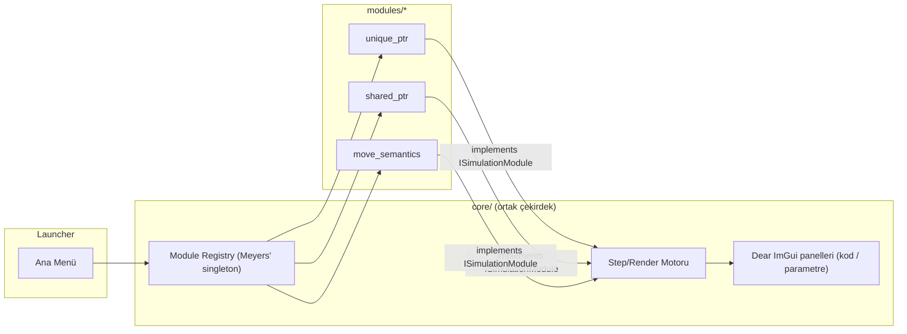
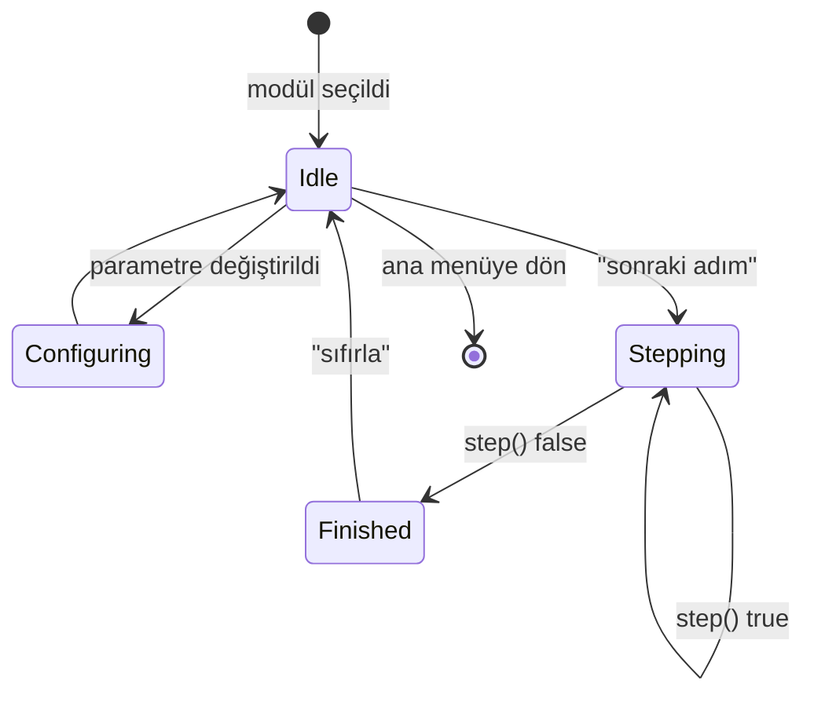

# underhood — Core Framework + İlk 3 Modül — Tasarım

**Tarih:** 2026-08-24
**Durum:** Onaylandı, implementasyon planı bekleniyor

## 0. Planlama & Analiz

### Problem tanımı
C++'ın niş/soyut davranışlarını (sahiplik transferi, move semantics, akıllı pointer yaşam döngüsü vb.) zihinde canlandırmak zor, bilgi kalıcı olmuyor. Statik metin/diyagram anlatımı yetersiz kalıyor.

### Gereksinimler

**Fonksiyonel:**
- Kullanıcı ana menüden bir modül (konu) seçebilir.
- Modül, sabit bir kod snippet'ini gösterir.
- Kullanıcı başlangıç parametrelerini UI'dan değiştirebilir (kod sabit kalır, derleme gerekmez).
- "Sonraki adım" ile step-by-step ilerler, "sıfırla" ile modülü baştan başlatır.
- Her adımda bellek/pointer durumu animasyonlu güncellenir, o an vurgulanan kod satırıyla senkron gösterilir.
- Katkıcı yeni modül eklerken `ISimulationModule` arayüzünü implement eder + `modules/_template/` klasörünü kopyalar + CMake'e bir satır ekler; launcher kodu değişmez.

**Fonksiyonel olmayan:**
- Cross-platform: Windows/Linux/Mac, CI'da üçünde de doğrulanır.
- İzolasyon: bir modülün derleme/çalışma zamanı hatası diğer modülleri/launcher'ı etkilemez.
- Akıcı animasyon (raylib varsayılan ~60 FPS).
- Yeni modül eklemek minimal boilerplate ister.

**İş gereksinimleri:**
- Paydaş: Efecan (birincil, gerçek öğrenme ihtiyacı), diğer C++ öğrencileri/katkıcılar (ikincil).
- Başarı kriteri: en az 3 çalışan modül, CI yeşil, kavramsal netliğin gerçekten artması.

### Teknoloji seçimi ve gerekçe
- **Dil: C++** — kullanıcının bilinçli tercihi; ayrıca dogfooding değeri var (aracın iç mekanizmaları — örn. `unique_ptr` ile registry sahipliği — öğrettiği kavramları kendi kod tabanında da sergiliyor). Çoklu dil değerlendirildi, YAGNI gereği reddedildi (bkz. §7 elenen alternatifler).
- **Grafik: raylib** — minimal boilerplate, C++'tan rahat kullanılıyor, CMake entegrasyonu kolay.
- **UI katmanı: Dear ImGui + rlImGui** — parametre paneli/buton/kod paneli gibi "tool UI" için immediate-mode GUI; elle raylib çizim boilerplate'inden kaçınmak için seçildi.
- **Test: Catch2** — header-only, CMake entegrasyonu kolay, GUI'siz modül mantığı test edilir.

### Sıfırdan mı, açık kaynaktan mı (standart §0.4)
Web araması yapıldı (2026-08-24): native masaüstü GUI + modüler/katkıya-açık + adım-adım kod↔görsel senkronizasyonu birleşimini sağlayan hazır bir açık kaynak proje bulunamadı. En yakın eşleşme `codevisualizer.app` — web tabanlı, katkıya kapalı, bu projenin "framework" hedefiyle örtüşmüyor. `raylib-cpp` (OOP wrapper) ve `rlImGui` (ImGui binding) mevcut, ikisi de bağımlılık olarak kullanılacak — sıfırdan yazılan sadece framework'ün kendisi (modül arayüzü, registry, step motoru).

### API kontratı
Dış servis/API yok (network bağımsız masaüstü GUI). İç kontrat: `ISimulationModule` arayüzü — modüller ile çekirdek arasındaki tek temas noktası.

```cpp
struct Parameter {
    std::string name;
    int value;       // ilk sürüm: tam sayı parametreler yeterli
    int minValue;
    int maxValue;
};

class ISimulationModule {
public:
    virtual ~ISimulationModule() = default;
    virtual std::string name() const = 0;
    virtual std::string codeSnippet() const = 0;
    virtual std::vector<Parameter> parameters() const = 0;
    virtual void reset(const std::vector<Parameter>& params) = 0;
    virtual bool step() = 0;                       // true: devam ediyor, false: bitti
    virtual int currentHighlightedLine() const = 0; // kod panelinde vurgulanacak satır
    virtual void render(Canvas& canvas) const = 0;  // bellek/pointer kutularını çiz
};
```

### Mimari & pattern kararları
- **Modüler monolith:** tek launcher binary, her modül bağımsız CMake static-lib target'ı (`modules/<isim>/`), `BUILD_MODULE_<NAME>` flag'iyle aç/kapa edilebilir.
- **Registry: Meyers' singleton (lazy-init `static` local)** — global statik nesnelerle self-registration'ın yol açtığı *static initialization order fiasco* riskini ortadan kaldırmak için. Her modül, ilk çağrıda oluşturulan tek registry nesnesine kendini kaydeder; registry'nin varlığı ilk erişimde garanti edilir, initialization sırası belirsizliği ortadan kalkar.
- **Bağımlılık kuralı:** `modules/*` → `core/`'a bağımlı, tersi değil. `core/` hiçbir modülü bilmez (yalnızca `ISimulationModule` arayüzü üzerinden konuşur).

### Diyagramlar

**Component diagram:**



**State diagram (bir modülün yaşam döngüsü):**



### Use case senaryoları
- **UC1 — Öğrenen kullanıcı:** unique_ptr modülünü açar → başlangıç değerini değiştirir → adım adım ilerler → move edildiğinde eski pointer'ın `nullptr` olduğunu görsel olarak izler → kavramı pekiştirir.
- **UC2 — Katkıcı:** `CONTRIBUTING.md`'yi okur → `modules/_template/` klasörünü kopyalar → `ISimulationModule`'ü kendi konusu için implement eder → CMake'e satırı ekler → PR açar → CI (build+test, 3 platform) yeşil olunca merge edilir.
- **UC3 — Bozuk modül:** Bir modülde derleme hatası oluşur → CI o modülün target'ında kırmızı verir → PR merge edilmez → `main` hep sağlam kalır (launcher hiçbir zaman bozuk modülle birlikte yayınlanmaz).

## 1. İlk kapsam

3 bağımsız modül: `unique_ptr`, `shared_ptr`, `move_semantics`. Ortak çekirdek bu üçü üzerinden doğrulanır (framework tek modülle değil, gerçek çeşitlilikle test edilmiş olur).

## 2. Proje başlatma şeması (standart §3)

- `README.md` (İngilizce, §5 şablonu — dış/portföy hedef kitle)
- `CLAUDE.md` — mimari kararların "why"ı, çalıştırma komutları
- `HANDOFF.md` — AI devir dosyası (§16 formatı)
- `.gitignore` — C++ (build/, CMakeCache.txt, vb.)
- `.env.example` — gerekmiyor (secret/config yok), bu adım atlanır
- `LICENSE` — MIT (§9 varsayılanı)
- `CONTRIBUTING.md` — yeni modül ekleme rehberi
- `docs/architecture.md` — bu spec'teki mimari kararların kalıcı özeti

## 3. Test / CI (standart §6, §12)

- Her modülün `step()`/parametre mantığı Catch2 ile GUI'siz unit test edilir.
- GitHub Actions: Windows/Linux/Mac üçünde `build + test` job'u; `main`'e merge için CI yeşil şartı (§18 Definition of Done).

## 4. Elenen alternatifler

- **Her konu ayrı `.exe`:** modüller izole ama pencere/input/render boilerplate'i her modülde tekrar eder, geçişler kesintili — framework'ün "ortak çekirdek" faydası kaybolur.
- **Runtime plugin (dynamic library):** en esnek ama cross-platform dynamic loading + ABI uyumluluğu bu ölçekte (birkaç eğitim modülü) gereksiz karmaşıklık.
- **Çoklu dil (simülasyon dışı parçalar için ayrı dil):** şu an gerçek bir ihtiyaç yok (YAGNI). Tek aday olabilecek "modül scaffolding otomasyonu" için de ayrı bir dile gerek yok — `modules/_template/` kopyala-yapıştır + `CONTRIBUTING.md` talimatı yeterli.
- **Global statik self-registration:** static initialization order fiasco riski taşıdığı için Meyers' singleton lazy-init pattern'i tercih edildi.
